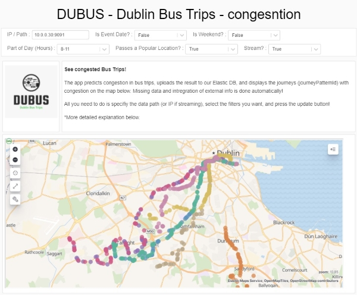
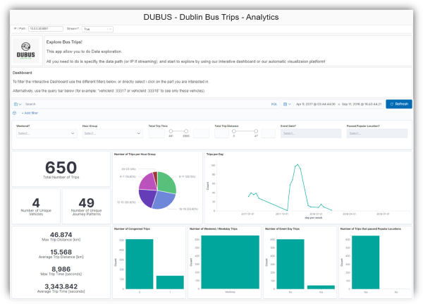

# DUBUS - Dublin Bus Trips :bus::bus::bus:

## :loudspeaker::loudspeaker::loudspeaker: IMPORTANT NOTE :loudspeaker::loudspeaker::loudspeaker:

**The below provides a short overview of the project + an installation guide. 
For the full descriptions, explanations and such please see the [Main notebook](https://scaperex.github.io/DUBUS/) 
or download it from [Lab4_Main](Lab4_Main.html)!** :lotus_position:

Table of contents
=================

<!--ts-->
  * [Project Overview](#project-overview)
  * [DUBUS - Dublin Bus Trips Congestion](#dubus---dublin-bus-trips-congestion)
  * [DUBUS - Dublin Bus Trips Analytics](#dubus---dublin-bus-trips-analytics)
  * [Usage](#usage)
  * [Code Structure](#code-structure)
  * [Installation](#installation)
<!--te-->

Project Overview
================
Welcome to DUBUS! Your Dublin bus trip app for congestion prediction and trip analytics!

The app includes two parts - **DUBUS - Dublin Bus Trips Congestion** and **DUBUS - Dublin Bus Trips Analytics**.

We gather raw bus sensor data, aggregate it into meaningful bus trips and present it to you for your city planning or other business uses.  

DUBUS - Dublin Bus Trips Congestion
-----------------------------------
This part of the application includes an interactive map that displays the journeys with congestion, from uploaded stream or batch bus data.

DUBUS - Dublin Bus Trips Analytics
----------------------------------
This part of the application includes modern-day data exploration tools, bundled in a convenient interface.

Part of the app:

Usage 
=====

DUBUS - Dublin Bus Trips Congestion is run from *[Lab4_UI_part1.ipynb](code/Lab4_UI_part1.ipynb)* and DUBUS - Dublin Bus Trips Analytics is run from *[Lab4_UI_part2.ipynb](code/Lab4_UI_part2.ipynb)*.

Once the app is up and running you can use it easily, just follow the in-app instructions. 

The in-app instructions describe in detail the different options that you have when using the application, and also thorough instructions on how to use the app.

Follow the [installation steps](#installation) to install the app on your machine.

Additionally, if this is your first time running the app, please refer to **first time setup** part in the [installation guide](./INSTALLATION.md#first-time-setup).

Notes,

1. As we are displaying our app inside Databricks, you must have a valid Databricks account inorder to interact with the app. 
2. The VM server must be on for the app to work.
3. There are security limitations. Please see the **notes section** in the [installation guide](./INSTALLATION.md#notes) on how to deal with them.
4. When using your own data make sure it follows the accepted schema. In general, records should include the fields -
`'_id', 'delay', 'congestion', 'lineId', 'vehicleId', 'timestamp', 'areaId', 'areaId1', 'areaId2', 'areaId3', 'gridID', 'actualDelay', 'longitude', 'latitude', 'currentHour', 'dateTypeEnum', 'angle', 'ellapsedTime', 'vehicleSpeed', 'distanceCovered', 'journeyPatternId', 'direction', 'busStop', 'poiId', 'poiId2', 'systemTimestamp', 'calendar', 'filteredActualDelay', 'atStop', 'dateType', 'justStopped', 'justLeftStop', 'probability', 'anomaly', 'loc'`. Specific types examples and can be found in the notebooks. 

Code Structure
==============

The project consists of multiple notebooks that work and interact together.

*Lab4_Preparations* consists of the preprocessing part, in which we also train and save the ML model, and the relevant helper models (indexer and encoder, for categorical variables).

*Lab4_UI_part1* - The front-end of the DUBUS - Dublin Bus Trips Congestion App (first part).

*Lab4_UI_part2* - The front-end of the DUBUS - Dublin Bus Trips Analytics App (second part).

*Lab4_functions* includes all the functions we used through out the project. Includes back-end connection functions (such as connecting to Elastic) as well. 

In addition, *Lab4_Main*  includes explanations and descriptions about the reasoning behind Part 1 (Preprocessing & App) and Part 2 (EDA, Article and App). 

Installation
============
We provide full explanations on how to set up and get the app up and running on **your** system as well.

For the full installation guide please see the [installation guide](./INSTALLATION.md)

However, **be aware!** There are a lot of steps that need to be taken in order to allow everything (DataBricks, Kibana, ElasticSearch) to work and communicate with each other.
